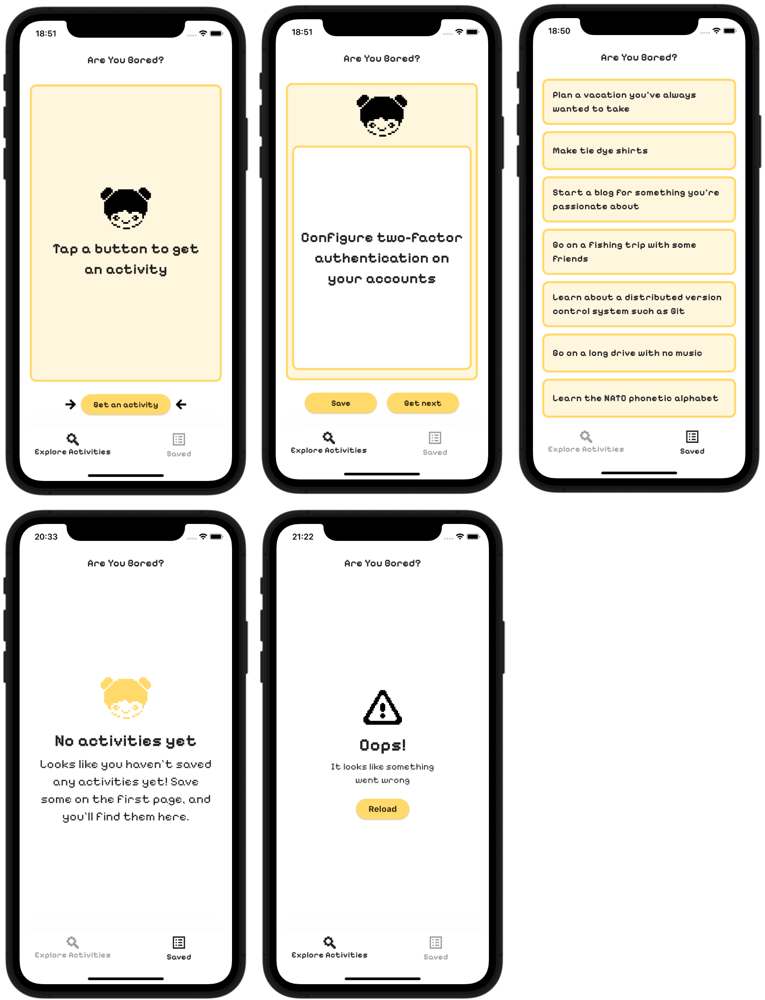
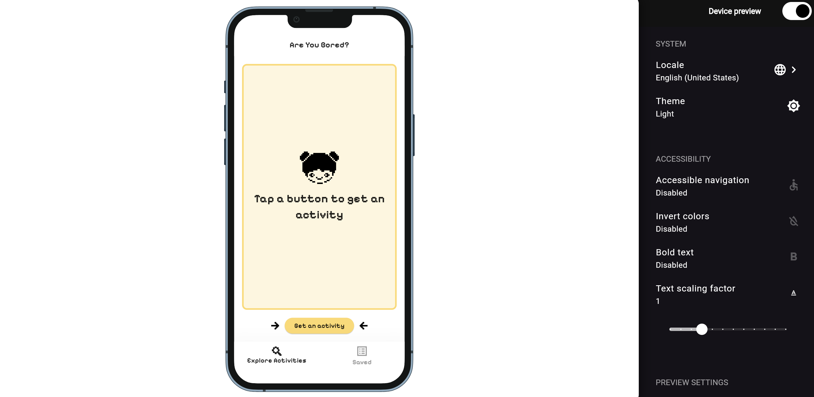

<h1 align="center">AreYouBored</h1>

<div align="center">
   
</div>

<h4 align="center">
Flutter app that uses BLoC pattern to help you discover activities when you're bored.
</h4>

[](https://github.com/yaolya/flutter-are-you-bored/actions/workflows/test.yml)

---



---

## Features
- Discover activities.
- Save activities for the future.
- Remove activities from the list.

## Run the project
1. Ensure [Flutter](https://flutter.io/setup/) is installed
   ```bash
   flutter --version
   ```
2. Clone this repository
    ```bash
   git clone https://github.com/yaolya/flutter-are-you-bored.git
   ```
3. Navigate to the project directory
    ```bash
   cd flutter-are-you-bored
   ```
4. Run app
   ```bash
   flutter run
   ```

---
## → [web app demo](https://yaolya.github.io/flutter-are-you-bored) ←  

[](https://yaolya.github.io/flutter-are-you-bored)

## Project Structure

```
.
├── lib/
│   ├── business_logic/
│   │   ├── activities_list/  # activities list cubit and state
│   │   └── activity/  # activity cubit and state
│   ├── data/
│   │   ├── database/  # sqflite database
│   │   ├── entities/  # models 
│   │   ├── network/  # api requests
│   │   └── repositories/  # repository implementations, including mock repository for unit tests
│   ├── main.dart 
│   └── ui/  # app screens
├── README.md 
├── pubspec.yaml
└── test/  # unit tests
```

